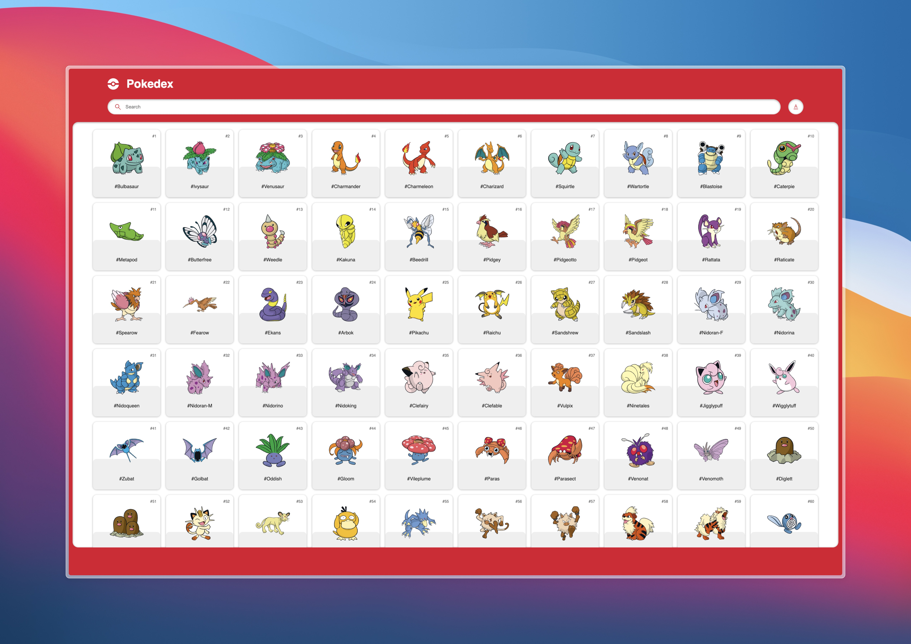
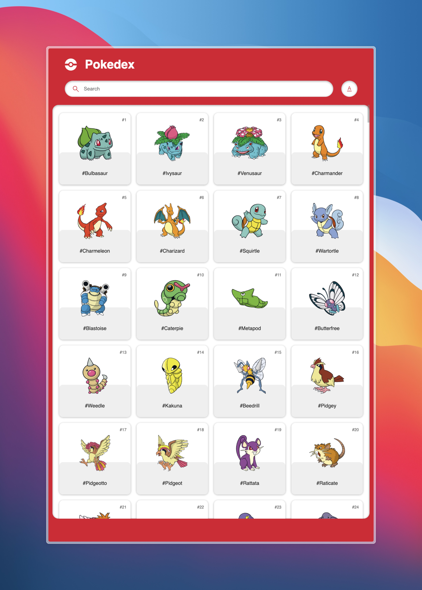

# Pokédex



## Description

The Pokédex is a web application made with **Html, Css and JavaScript** that allows you to search and view information about Pokémon using the **PokeAPI**. This application displays the **original 151 Pokémon** from the Kanto region, and **349 more**, with an intuitive and easy-to-use interface.

## Features

- **Quick Search:** Search for any Pokémon by name or number in real time.
- **Dynamic User Interface:** A clean and attractive UI for a pleasant user experience.
- **Detailed Information:** Displays specific details about each Pokémon, including its abilities, stats and types.
- **Intuitive Navigation:** Easy navigation between the different Pokémon.

## Screenshots



## Technologies Used

- **HTML5** and **CSS3**: Page structure and styling.
- **JavaScript (ES6+)**: Client-side logic.
- **PokeAPI**: External API to get data about Pokémon.
- **Git**: Version control.
- **GitHub**: Source code storage.

## Installation

1. **Clone the repository:**
```sh
git clone https://github.com/your_user/pokedex.git
```
2. **Navigate to the project directory:**
```sh
cd pokedex
```
3. **Open the index.html file in your browser:**
```sh
open index.html
```
## Usage

- Search for Pokémon: Type the Pokémon's name or number into the search bar to quickly find it.
- View Details: Click on any Pokémon to see more specific details about it.
- Navigate Between Pokémon: Use the navigation arrows to move between different Pokémon.

## Credits

- <https://pokeapi.co>
- <https://github.com/PokeAPI/sprites>